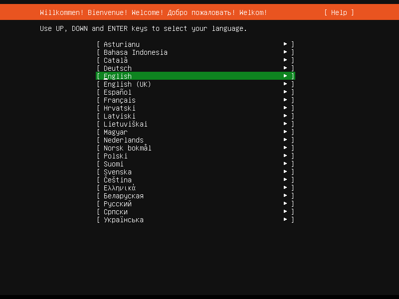
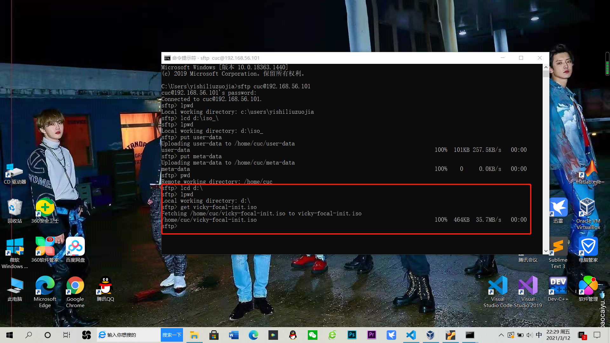
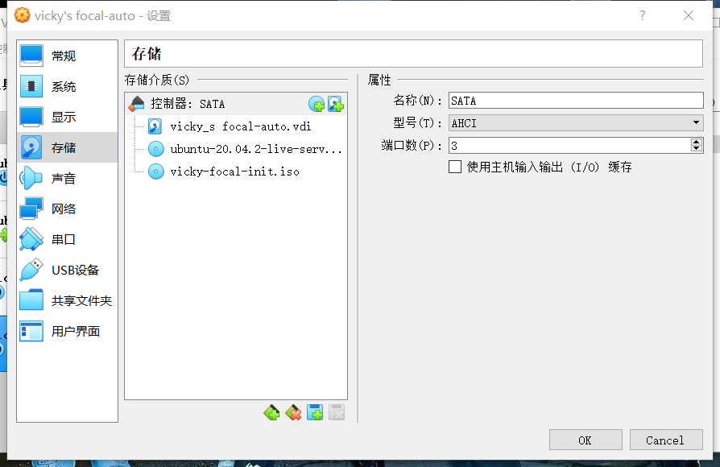

# 实验问题
+ 如何配置无人值守安装iso并在Virtualbox完成自动化安装
+ Virtualbox安装完Ubuntu之后新添加的网卡如何实现系统开机自动启用和自动获取IP？
+ 如何使用sftp在虚拟机和宿主机之间传输文件？

# 主要操作步骤
### 1.提前下载好纯净版 Ubuntu 安装镜像 iso 文件

### 使用手动安装 Ubuntu 

##### 默认英语

##### 检测网卡

##### 用户名设置

##### 开始安装

##### 安装完成

### 2.新建可以用于安装 Ubuntu 64位系统的虚拟机配置

### 3.制作包含user-data 和 meta-data 的 ISO 镜像文件，命名为 vicky-focal-init.iso，我设置的meta-data文件为空

##### 查看Ubuntu的IP地址

##### 利用SSH

##### 使用sftp将user-data和meta-data传输到虚拟机里

##### 在虚拟机中看到两个文件已经成功上传

##### 软件包更新

##### 用以下代码安装无人值守相关依赖工具
`` # ubuntu ``

``sudo apt install genisoimage``

##### 创建vicky-focal-init.iso镜像
``genisoimage -output vicky-focal-init.iso -volid cidata -joliet -rock user-data meta-data``

##### 将刚刚制作成功的iso镜像文件保存到主机D盘根目录

### 4.移除上述虚拟机「设置」-「存储」-「控制器：IDE」

### 5.在「控制器：SATA」下新建 2 个虚拟光盘

##### 按顺序 先挂载「纯净版 Ubuntu 安装镜像文件」

##### 后挂载 focal-init.iso

##### 第二块网卡设置成host-only

### 6.「无人值守安装」程序自动完成系统安装和重启进入系统可用状态

##### 确认好存储设置并启动虚拟机

### 学习sftp的参考链接
<https://www.cnblogs.com/afeige/p/12144296.html>
